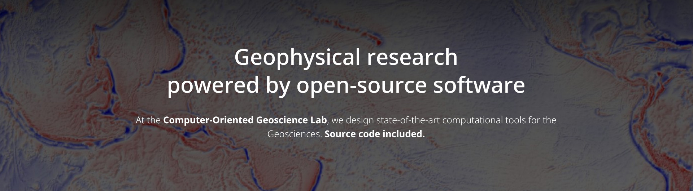

<h1 align="center">👋 Welcome to the CompGeoLab!</h1>

We're a research group based primarily at the 
[University of Liverpool](https://www.liverpool.ac.uk/earth-ocean-and-ecological-sciences/). 
We are experts in solving **inverse problems** in **Geophysics**
and building **open-source scientific software**.

## Work with us!

> ⚠️ **Before you decide to work with us:** read the 
> [Lab Manual](https://github.com/compgeolab/manual) carefully to make sure you
> agree with our stance on open-access, FAIR data/software, and overall work
> ethics.

🤝 **Collaborations:** We're always interested in new collaborations and interesting
projects. Get in touch!

👩‍🎓 **Funded positions (PhD & postdoc):** 
We'll post calls in the 
<a href="https://www.compgeolab.org/news/">lab updates</a>
and <a href="https://twitter.com/leouieda">social media</a>.

💰 **Have your own funding:** Talk to [Leo](https://www.compgeolab.org/team/) 
if you're interested in a self-funded PhD or applying for externally-funded 
postdoc fellowships.
